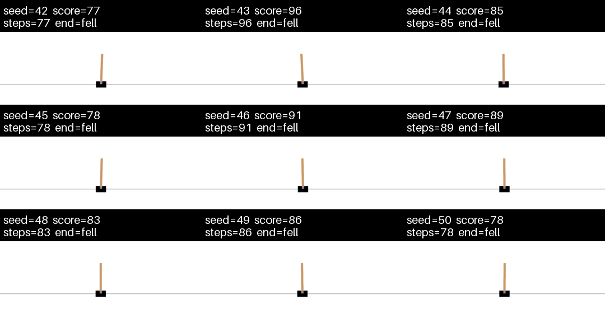
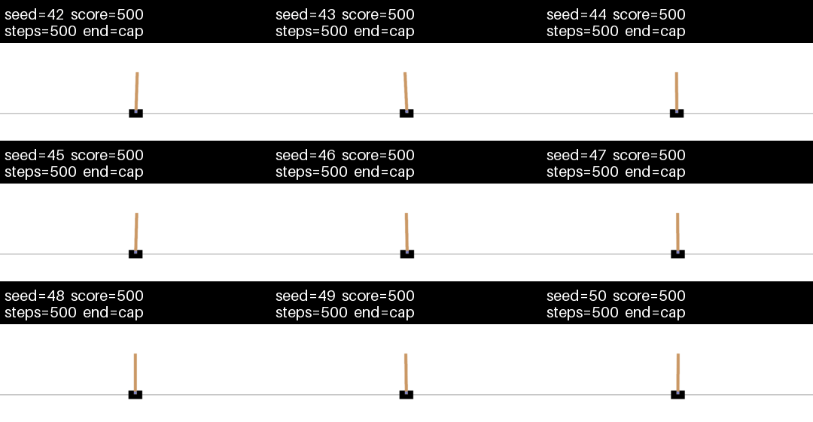
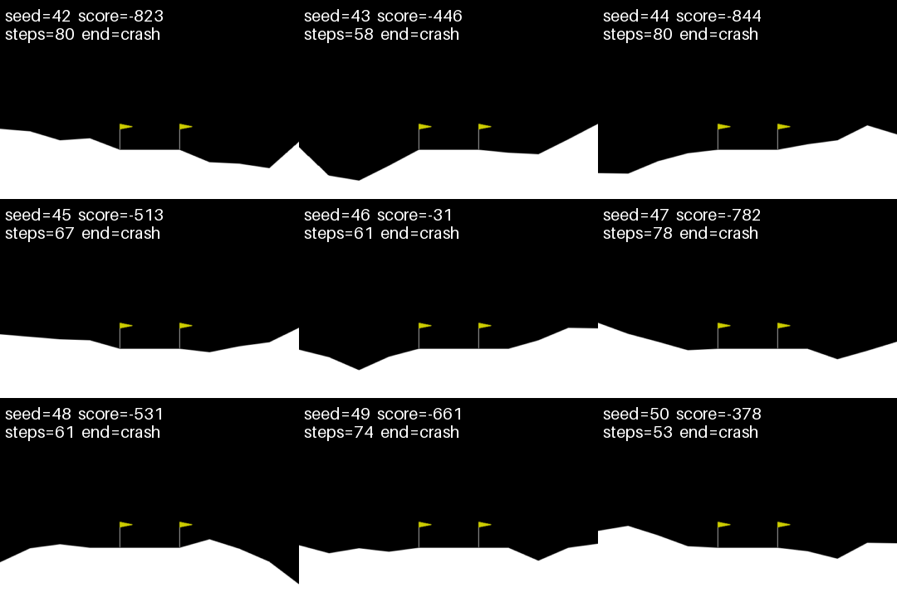
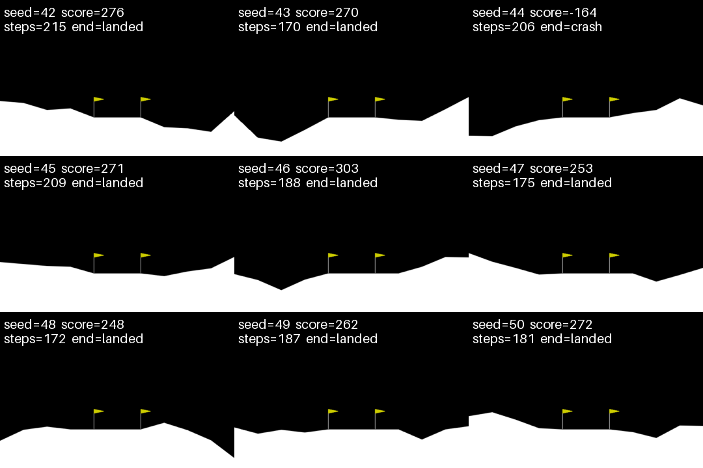

# Playing Atari with Deep RL — DQN Lab

The [DeepMind DQN paper](https://arxiv.org/pdf/1312.5602) (`playing-atari-with-drl.pdf` in this folder) learns Atari from pixels with a CNN, replay memory, and ε-greedy exploration. This repo is a **vector-MLP lab** on the same algorithm family — pick a game via config, edit `dqn/` for quests.

| Game | Difficulty | Baseline config | Weights |
|------|------------|-----------------|---------|
| **CartPole** | Easy (~2 min GPU) | `configs/cartpole_paperlike.yaml` | `baselines/cartpole_seed42/model.pt` |
| **LunarLander** | Harder (~30–60 min GPU) | `configs/lunarlander_baseline.yaml` | `baselines/lunarlander_seed42/model.pt` |

**CartPole** trains quickly and curves are stable — good for smoke tests. **LunarLander** takes longer and learning is noisier (landings vs crashes vary a lot), but quest changes show up more clearly. Same code path for both; only the YAML changes.

---

## Untrained vs trained (3×3 grids)

Each cell is one **greedy** episode. Overlays: `seed=`, `score=`, `steps=`, `end=` (`fell` / `cap` / `landed` / `crash` / `timeout`).

<table>
  <tr>
    <th></th>
    <th align="center">Untrained</th>
    <th align="center">Trained baseline</th>
  </tr>
  <tr>
    <th align="center">CartPole<br/><em>easy</em></th>
    <td align="center"></td>
    <td align="center"></td>
  </tr>
  <tr>
    <th align="center">LunarLander<br/><em>harder</em></th>
    <td align="center"></td>
    <td align="center"></td>
  </tr>
</table>

Regenerate locally (CPU keeps RAM down on small VMs):

```bash
export CUDA_VISIBLE_DEVICES=""
python -m cartpole.record --mode untrained --config configs/cartpole_paperlike.yaml --grid 3 --output assets/cartpole_untrained_grid.gif
python -m cartpole.record --mode checkpoint --checkpoint baselines/cartpole_seed42/model.pt --grid 3 --output assets/cartpole_trained_grid.gif
python -m lunarlander.record --mode untrained --config configs/lunarlander_baseline.yaml --grid 3 --output assets/lunarlander_untrained_grid.gif
python -m lunarlander.record --mode checkpoint --checkpoint baselines/lunarlander_seed42/model.pt --grid 3 --output assets/lunarlander_trained_grid.gif
```

---

## CartPole in one minute

A cart on a track; a pole hinged on top. Each step: push **left** or **right**. Episode ends if the pole falls or the cart leaves the track.

**Score:** +1 per timestep upright → **steps survived** (500 steps ≈ 10 s). **Solved:** greedy score **500/500** (training cap).

**Try it:** [CartPole in the browser](https://jeffjar.me/cartpole.html) · local: `python -m cartpole.play`

---

## LunarLander in one minute

Land a craft on a pad between flags. Discrete actions: **noop**, **left engine**, **main engine**, **right engine** (same stack as Gymnasium `LunarLander-v3`).

**Score:** shaped landing reward (fuel, speed, legs, pad contact). High variance — one seed lands, the next crashes. **Solved:** mean greedy return **≥ 200** over many episodes. Needs `gymnasium[box2d]`.

**Try it:** [Lunar Lander in the browser](http://moonlander.seb.ly/) · local: `python -m lunarlander.play`

---

## Start here

```bash
bash scripts/setup.sh && source .venv/bin/activate
```

| Step | Action |
|------|--------|
| 1 | `notebooks/01_watch.ipynb` — set `GAME` to `cartpole` or `lunarlander` |
| 2 | `notebooks/02_train.ipynb` — same `GAME`, reproduce a baseline |
| 3 | Pick a quest → `notebooks/03_quest.ipynb` |

Use **CartPole** for a quick pass; use **LunarLander** when you want quest effects to move the learning curve.

---

## Baselines (seed 42)

Frozen weights in `baselines/` — do not overwrite when experimenting (train into `outputs/` instead).

| Game | Eval highlight | Details |
|------|----------------|---------|
| CartPole | mean **500/500** steps (20 ep, greedy) | `baselines/cartpole_seed42/RESULTS.md` |
| LunarLander | mean **~208** (100 ep, greedy; solved ≥ 200) | `baselines/lunarlander_seed42/RESULTS.md` |

```bash
python train.py --config configs/cartpole_paperlike.yaml --seed 42 --overwrite
python train.py --config configs/lunarlander_baseline.yaml --seed 42 --overwrite

python evaluate.py --checkpoint baselines/cartpole_seed42/model.pt --episodes 20 --seed 42
python evaluate.py --checkpoint baselines/lunarlander_seed42/model.pt --episodes 100 --seed 42
```

---

## Quests

Change **one** thing in `dqn/` or config, retrain, compare `outputs/.../plots/` to the baseline.

Quests run on **either** game via the config / notebook `GAME` switch. **CartPole** trains faster and is usually easier / more stable — good for a quick pass. **LunarLander** takes longer and curves are messier / less stable, but differences from a quest often show up more clearly.

| # | Quest | Effort |
|---|-------|--------|
| 1 | [ε-greedy annealing](quests/01_change_epsilon_schedule.md) | easy |
| 2 | [Experience replay](quests/02_change_replay_memory.md) | easy–med |
| 3 | [Target network (2013 vs Nature)](quests/03_add_target_network.md) | easy |
| 4 | [RMSProp vs Adam](quests/04_compare_optimizers.md) | easy |
| 5 | [MSE vs Huber loss](quests/05_mse_vs_huber.md) | easy |
| 6 | [Double DQN](quests/06_double_dqn.md) | medium |
| 7 | [Discount $\gamma$ (return)](quests/07_discount_gamma.md) | easy |

Edit `dqn/` for quests. Ignore `cartpole/`, `lunarlander/`, `envs.py`, and `scripts/` unless debugging plumbing or tooling.

---

## Layout

```text
train.py / evaluate.py   entry points
envs.py                  routes config env_id → cartpole or lunarlander
dqn/                     algorithm (quest edits)
configs/                 cartpole_paperlike + lunarlander_baseline
baselines/               frozen weights + RESULTS
assets/                  grid GIFs above
notebooks/               01 watch · 02 train · 03 quest
quests/                  experiment guides
cartpole/ lunarlander/   env + record + play
scripts/                 setup.sh + lab_gif.py (GIF tooling)
outputs/                 your runs (gitignored; created on train)
```

---

## Colab

```python
REPO_URL = "https://github.com/danielvallejo237/Club_Lectura_Papers.git"
%cd Club_Lectura_Papers/code/playing-atari-with-drl
!pip install -q -r requirements.txt
```

Open `notebooks/01_watch.ipynb`. Save a copy before editing.
