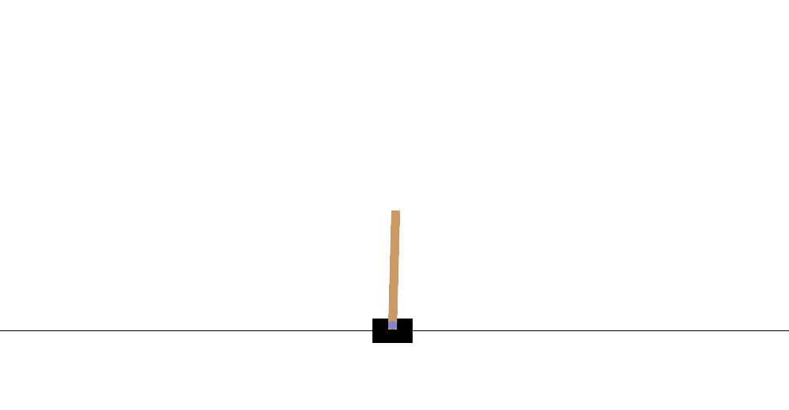
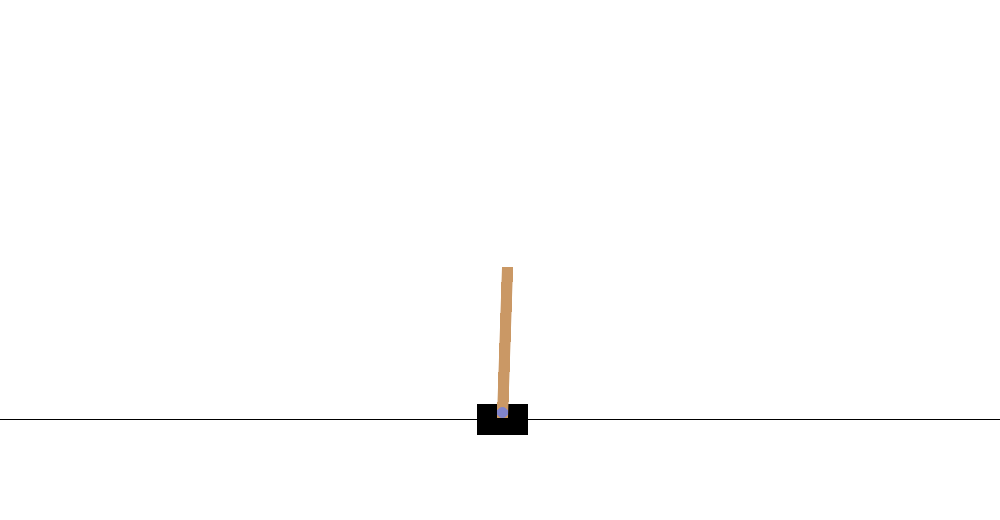

# Playing Atari with Deep RL — CartPole DQN Lab

The [DeepMind DQN paper](https://arxiv.org/pdf/1312.5602) (`playing-atari-with-drl.pdf` in this folder) learns to play Atari games from pixels using a convolutional Q-network, experience replay, and ε-greedy exploration. Atari runs are heavy (GPU time, long training, image preprocessing).

This repo is a **small, readable lab** on the same algorithm family: **DQN on CartPole** — a cart with a pole that must stay upright. State is four numbers (cart position, velocity, pole angle, angular velocity), not screen pixels. Training finishes in minutes on CPU. The code mirrors the paper’s ingredients (replay buffer, MLP Q-network, RMSProp, ε-decay) so changes map back to the Atari setup.

---

## CartPole in one minute

A cart moves on a track. A pole is hinged on the cart. Each timestep you push **left** or **right**. The episode ends when the pole falls past an angle limit or the cart leaves the track.

**Score:** reward is **+1 per timestep** the pole stays up. The on-screen score is **how many steps survived** (not cumulative reward from other sources). Roughly **0.02 s per step**, so score 500 ≈ 10 s of balance. Training episodes truncate at **500 steps** (CartPole-v1 style); a fall ends the episode earlier.

**Human play:** [CartPole in the browser](https://jeffjar.me/cartpole.html) (arrow keys or h/l) uses similar wide physics so you can feel the task before touching code.

### Untrained vs trained

Left: a **fresh Q-network** (random weights, greedy actions) — falls quickly. Right: the **seed-42 baseline** after ~50k training steps — holds the pole.

<table>
  <tr>
    <th align="center">Untrained (random weights)</th>
    <th align="center">Trained baseline (seed 42)</th>
  </tr>
  <tr>
    <td align="center"></td>
    <td align="center"></td>
  </tr>
</table>

Record your own clips: `python -m cartpole.record --mode untrained` or `--mode checkpoint --checkpoint baselines/cartpole_seed42/model.pt`.

---

## Pre-trained baseline

A reference run is stored so notebooks and eval work without retraining:

| Item | Value |
|------|-------|
| **Weights** | `baselines/cartpole_seed42/model.pt` |
| **Config** | `configs/cartpole_paperlike.yaml`, seed **42** |
| **Size** | ~72 KB (small MLP: 128→128 hidden units) |
| **Timed eval** | mean return **500 / 500** steps (20 episodes, greedy) |

Copy for local experiments: `checkpoints/cartpole_baseline/`. Reproduce from scratch:

```bash
python train.py --config configs/cartpole_paperlike.yaml --seed 42 --overwrite
```

Details and gate checks: `baselines/cartpole_seed42/RESULTS.md`.

---

## What you can do here

| Activity | What it means |
|----------|----------------|
| **Play** | Browser or `python -m cartpole.play` — learn the physics by hand. |
| **Watch** | Short **GIF recordings** of random, untrained, or checkpoint agents (`notebooks/01_watch.ipynb` or `cartpole.record`). “Watch” = see the cart move step-by-step, not read loss curves. |
| **Train** | Run DQN from config; metrics and plots land in `outputs/`. |
| **Quests** | Optional one-change experiments (below) — edit a single part of `dqn/`, retrain, compare curves. |

Colab-first: open the notebooks with minimal local setup. Local install: `bash scripts/setup.sh`.

---

## Start here

| Step | Why | Action |
|------|-----|--------|
| 1 | Know what “balancing” feels like | [CartPole in the browser](https://jeffjar.me/cartpole.html) |
| 2 | See failure vs success on video | `notebooks/01_watch.ipynb` — records GIFs (random / untrained / baseline) |
| 3 | Run or reproduce training | `notebooks/02_train.ipynb` or `python train.py --config configs/cartpole_paperlike.yaml --seed 42` |
| 4 | Change one DQN piece | Pick a quest below → `notebooks/03_quest.ipynb` |

The DQN agent only uses **left / right** thrust. Local human play can **coast** when no key is held; the learned policy does not use a coast action.

---

## Quests

**Quests** are guided tweaks: change **one** baseline component (ε schedule, replay size, target network, etc.), keep the rest fixed, and compare `outputs/<experiment>/seed_<N>/plots/` and `metrics.csv` to the baseline.

| # | Quest | What it explores | Objective |
|---|-------|------------------|-----------|
| 1 | [Epsilon schedule](quests/01_change_epsilon_schedule.md) | Exploration rate ε during training | See how faster or slower ε decay affects learning speed and final score |
| 2 | [Replay memory](quests/02_change_replay_memory.md) | Experience replay capacity | Compare small vs large buffer; observe sample diversity and stability |
| 3 | [Target network](quests/03_add_target_network.md) | Fixed bootstrap target for Q-learning | Add or tune a target net; compare stability to the no-target baseline |
| 4 | [Compare optimizers](quests/04_compare_optimizers.md) | RMSProp vs Adam | Same network and replay; isolate optimizer effects on the learning curve |
| 5 | [Try LunarLander](quests/05_try_lunarlander.md) | Same DQN stack, harder environment | Apply the lab to discrete LunarLander with a new config |
| 6 | [Network architecture](quests/06_change_network_architecture.md) | Hidden size and activation | Test capacity vs training speed (wider/deeper MLP) |
| 7 | [Pixel CartPole + CNN](quests/07_pixel_cartpole_cnn.md) | Image observations + conv net | Move toward the pixel-based Atari setup in the paper |

Edit files under `dqn/` for most quests; `cartpole/` stays fixed so env physics match the baseline.

---

## Layout

```text
dqn/        ← Q-network, replay, loss, policy, agent (quest edits go here)
cartpole/   ← environment, GIF recording, local pygame play
train.py    ← training loop, metrics CSV, plots
evaluate.py ← greedy / ε-greedy evaluation
configs/    ← hyperparameters (cartpole_paperlike.yaml = baseline)
notebooks/  ← 01 watch, 02 train, 03 quest (Colab entry points)
quests/     ← per-quest instructions (linked above)
baselines/  ← frozen seed-42 weights + RESULTS
assets/     ← README comparison GIFs
outputs/    ← local training runs (gitignored)
```

---

## Commands

```bash
# setup (local)
bash scripts/setup.sh && source .venv/bin/activate

# train baseline (reproduce seed 42)
python train.py --config configs/cartpole_paperlike.yaml --seed 42 --overwrite

# evaluate timed episodes (500-step cap)
python evaluate.py --checkpoint baselines/cartpole_seed42/model.pt --episodes 20 --seed 42

# record GIF from checkpoint
python -m cartpole.record --mode checkpoint --checkpoint baselines/cartpole_seed42/model.pt

# local play (display required)
python -m cartpole.play
```

---

## Colab

```python
REPO_URL = "https://github.com/danielvallejo237/Club_Lectura_Papers.git"
%cd Club_Lectura_Papers/code/playing-atari-with-drl
!pip install -q -r requirements.txt
```

Open `notebooks/01_watch.ipynb`. Save a copy to Drive before editing.
